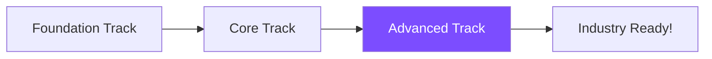

# Advanced Track

Welcome to the Advanced Track! This 14-week program covers cutting-edge AI technologies including transformers, LLMs, and production deployment.

## What You'll Learn

This track focuses on state-of-the-art AI systems and production workflows:

### Week 1-4: Transformers & LLMs
- Attention mechanisms and self-attention
- Transformer architecture deep dive
- BERT, GPT, and T5 models
- Fine-tuning large language models
- Prompt engineering and few-shot learning
- Working with Hugging Face ecosystem

### Week 5-7: Generative AI
- Variational Autoencoders (VAEs)
- Generative Adversarial Networks (GANs)
- Diffusion models (Stable Diffusion)
- Image generation and manipulation
- Text-to-image models
- Audio generation

### Week 8-10: MLOps & Production
- Model versioning and experiment tracking
- Docker containerization
- Model serving with FastAPI/Flask
- Cloud deployment (AWS/GCP/Azure)
- Monitoring and logging
- CI/CD for ML pipelines

### Week 11-14: Capstone Project
- End-to-end ML project
- From research to deployment
- Documentation and presentation
- Portfolio showcase

## Prerequisites

- Completion of [Core Track](../core/) or equivalent experience
- Strong Python and deep learning fundamentals
- Experience with PyTorch or TensorFlow
- Basic understanding of cloud platforms
- Git and version control knowledge

## Course Format

Each module includes:
- 🔬 Research paper walkthroughs
- 💡 Implementation of SOTA techniques
- 🏭 Production-grade code examples
- ☁️ Cloud deployment tutorials
- 🎨 Creative AI applications
- 📦 Complete MLOps workflows

## Get Started

**Coming Soon:** Detailed lesson modules are being developed. Check back soon or [watch the repository](https://github.com/rajgupt/ai-for-builders) for updates!

## Capstone Project Ideas

Choose from these production-ready projects:

- **Custom Chatbot:** Build and deploy a domain-specific conversational AI
- **Image Generation App:** Create a web app for AI image generation
- **Document QA System:** Build a question-answering system for documents
- **Real-time Object Detection:** Deploy object detection on edge devices
- **Recommendation Engine:** Build and scale a production recommendation system

## Tools & Technologies

You'll gain hands-on experience with:

- **Frameworks:** PyTorch, TensorFlow, Hugging Face Transformers
- **MLOps:** MLflow, Weights & Biases, DVC
- **Deployment:** Docker, Kubernetes, FastAPI, Streamlit
- **Cloud:** AWS SageMaker, GCP Vertex AI, Azure ML
- **Monitoring:** Prometheus, Grafana, ELK Stack

## Learning Path

After completing this track, you'll have production-ready AI skills and a portfolio of deployed projects.

---

[← Previous: Core Track](../core/) | [View Projects →](../../projects/)
