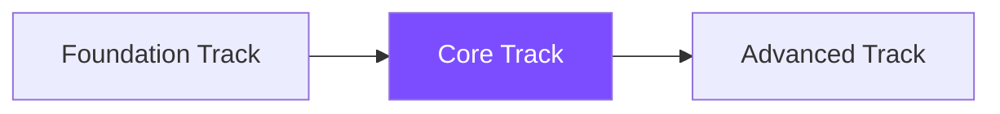

# Core Track

Welcome to the Core Track! This 10-week program dives deep into modern deep learning techniques and practical applications.

## What You'll Learn

This track covers essential deep learning frameworks and applications:

### Week 1-4: Deep Learning Fundamentals
- Neural network architectures
- Backpropagation and gradient descent
- Activation functions and optimization
- Regularization techniques
- PyTorch and TensorFlow basics

### Week 5-7: Computer Vision
- Convolutional Neural Networks (CNNs)
- Image classification and object detection
- Transfer learning with pre-trained models
- Data augmentation techniques
- Real-world CV projects

### Week 8-10: NLP Basics
- Text processing and tokenization
- Word embeddings (Word2Vec, GloVe)
- Recurrent Neural Networks (RNNs)
- Sequence-to-sequence models
- Sentiment analysis and text classification

## Prerequisites

- Completion of [Foundation Track](../foundation/) or equivalent knowledge
- Solid Python programming skills
- Understanding of basic ML concepts
- Familiarity with linear algebra and calculus

## Course Format

Each module includes:
- 🧠 Deep dive into theory and architectures
- 💻 Hands-on implementation from scratch
- 🚀 Industry-standard framework tutorials
- 📊 Real-world datasets and challenges
- 🏆 Portfolio-worthy projects

## Get Started

**Coming Soon:** Detailed lesson modules are being developed. Check back soon or [watch the repository](https://github.com/rajgupt/ai-for-builders) for updates!

## Sample Projects

By the end of this track, you'll build:

- **Image Classifier:** Multi-class classification on real-world datasets
- **Object Detector:** Detect and localize objects in images
- **Sentiment Analyzer:** Classify text sentiment from reviews
- **Text Generator:** Generate text using sequence models

## Learning Path

After completing this track, you'll be ready to advance to the [Advanced Track](../advanced/).

---

[← Previous: Foundation Track](../foundation/) | [Next: Advanced Track →](../advanced/)
