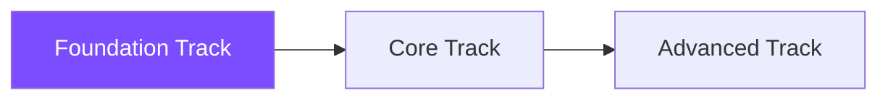

# Foundation Track

Welcome to the Foundation Track! This 7-week program is designed for developers who are new to AI and machine learning.

---

## 🚀 Start Learning Now

  <h3 style="color: white; margin-top: 0;">Python for AI</h3>
  

    ✅ Available Now | 7 Lessons + Mini Project | 2 Weeks
  

  

    Learn Python essentials for AI development, from basics to NumPy. Build a MNIST digit classifier!
  

  <a href="python-for-ai/" style="background: white; color: #667eea; padding: 0.75rem 2rem; border-radius: 4px; text-decoration: none; font-weight: bold; display: inline-block;">
    Start Python for AI →
  </a>

**Coming Soon:**
- 📐 Math Essentials (Weeks 3-4)
- 🤖 Introduction to ML (Weeks 5-7)

---

## What You'll Learn

This track covers the essential building blocks for AI development:

### Week 1-2: Python for AI
- Python fundamentals and data structures
- NumPy for numerical computing
- Pandas for data manipulation
- Matplotlib and visualization

### Week 3-4: Math Essentials
- Linear algebra basics
- Calculus fundamentals
- Probability and statistics
- Matrix operations

### Week 5-7: Introduction to ML
- Machine learning concepts
- Supervised vs unsupervised learning
- Classification and regression
- Model evaluation and validation

## Prerequisites

- Basic programming knowledge (any language)
- High school mathematics
- Access to Google Colab or Kaggle (free)

## Course Format

Each module includes:
- 📚 Concept explanations with visuals
- 💻 Interactive Jupyter notebooks
- 🧪 Hands-on coding exercises
- 🎯 Weekly mini-projects
- ✅ Knowledge assessments

## Learning Path

After completing this track, you'll be ready to advance to the [Core Track](../core/).

---

[← Back to Home](../../) | [Next: Core Track →](../core/)
