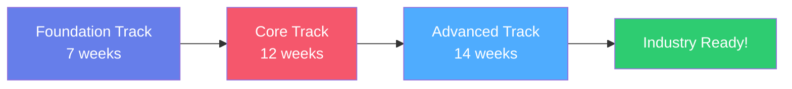

# All Courses

Explore our comprehensive AI learning curriculum, designed to take you from beginner to production-ready AI engineer.

---

## 🌱 Foundation Track

**Perfect for beginners** - Build essential programming and math skills for AI development.

  <!-- Python for AI Course -->
  

    
    

      <h3 style="margin-top: 0; color: #667eea;">Python for AI</h3>
      

        <strong>✅ Available Now</strong> | 7 Lessons | 2 Weeks
      

      

        Master Python essentials for AI development, from basics to NumPy. Build a MNIST digit classifier with hands-on Colab notebooks.
      

      <a href="foundation/python-for-ai/" style="background: linear-gradient(135deg, #667eea 0%, #764ba2 100%); color: white; padding: 0.75rem 1.5rem; border-radius: 4px; text-decoration: none; font-weight: bold; display: inline-block; width: 100%; text-align: center; box-sizing: border-box;">
        Start Course →
      </a>
    

  

  <!-- Math Essentials (Coming Soon) -->
  

    

      📐
    

    

      <h3 style="margin-top: 0; color: #f5576c;">Math Essentials</h3>
      

        <strong>⏳ Coming Soon</strong> | Weeks 3-4
      

      

        Linear algebra, calculus, probability, and statistics foundations for understanding ML algorithms.
      

      <button disabled style="background: #ccc; color: #666; padding: 0.75rem 1.5rem; border: none; border-radius: 4px; font-weight: bold; width: 100%; cursor: not-allowed;">
        Coming Soon
      </button>
    

  

  <!-- Introduction to ML (Coming Soon) -->
  

    

      🤖
    

    

      <h3 style="margin-top: 0; color: #4facfe;">Introduction to ML</h3>
      

        <strong>⏳ Coming Soon</strong> | Weeks 5-7
      

      

        Learn machine learning fundamentals: supervised/unsupervised learning, classification, regression, and model evaluation.
      

      <button disabled style="background: #ccc; color: #666; padding: 0.75rem 1.5rem; border: none; border-radius: 4px; font-weight: bold; width: 100%; cursor: not-allowed;">
        Coming Soon
      </button>
    

  

<a href="foundation/" style="display: inline-block; margin: 1rem 0; color: #667eea; text-decoration: none; font-weight: bold;">
  View Full Foundation Track →
</a>

---

## 🚀 Core Track

**Intermediate level** - Deep dive into neural networks, computer vision, and NLP.

  <!-- Deep Learning Fundamentals (Coming Soon) -->
  

    

      🧠
    

    

      <h3 style="margin-top: 0; color: #fa709a;">Deep Learning Fundamentals</h3>
      

        <strong>⏳ Coming Soon</strong> | 4 Weeks
      

      

        Neural networks, backpropagation, optimization algorithms, and PyTorch/TensorFlow frameworks.
      

      <button disabled style="background: #ccc; color: #666; padding: 0.75rem 1.5rem; border: none; border-radius: 4px; font-weight: bold; width: 100%; cursor: not-allowed;">
        Coming Soon
      </button>
    

  

  <!-- Computer Vision (Coming Soon) -->
  

    

      📷
    

    

      <h3 style="margin-top: 0; color: #30cfd0;">Computer Vision</h3>
      

        <strong>⏳ Coming Soon</strong> | 3 Weeks
      

      

        CNNs, image classification, object detection, transfer learning, and real-world CV applications.
      

      <button disabled style="background: #ccc; color: #666; padding: 0.75rem 1.5rem; border: none; border-radius: 4px; font-weight: bold; width: 100%; cursor: not-allowed;">
        Coming Soon
      </button>
    

  

  <!-- NLP Basics (Coming Soon) -->
  

    

      💬
    

    

      <h3 style="margin-top: 0; color: #a8edea;">NLP Basics</h3>
      

        <strong>⏳ Coming Soon</strong> | 3 Weeks
      

      

        Text processing, embeddings, RNNs, sequence models, and sentiment analysis projects.
      

      <button disabled style="background: #ccc; color: #666; padding: 0.75rem 1.5rem; border: none; border-radius: 4px; font-weight: bold; width: 100%; cursor: not-allowed;">
        Coming Soon
      </button>
    

  

  <!-- Model Deployment (Coming Soon) -->
  

    

      🚢
    

    

      <h3 style="margin-top: 0; color: #ff9a9e;">Model Deployment</h3>
      

        <strong>⏳ Coming Soon</strong> | 2 Weeks
      

      

        Deploy models with FastAPI, Docker containers, and cloud platforms (AWS, GCP, Azure).
      

      <button disabled style="background: #ccc; color: #666; padding: 0.75rem 1.5rem; border: none; border-radius: 4px; font-weight: bold; width: 100%; cursor: not-allowed;">
        Coming Soon
      </button>
    

  

<a href="core/" style="display: inline-block; margin: 1rem 0; color: #667eea; text-decoration: none; font-weight: bold;">
  View Full Core Track →
</a>

---

## ⚡ Advanced Track

**Production-ready skills** - LLMs, generative AI, MLOps, and capstone project.

  <!-- Transformers & LLMs (Coming Soon) -->
  

    

      🤯
    

    

      <h3 style="margin-top: 0; color: #667eea;">Transformers & LLMs</h3>
      

        <strong>⏳ Coming Soon</strong> | 4 Weeks
      

      

        Attention mechanisms, BERT, GPT architectures, fine-tuning LLMs, and Hugging Face ecosystem.
      

      <button disabled style="background: #ccc; color: #666; padding: 0.75rem 1.5rem; border: none; border-radius: 4px; font-weight: bold; width: 100%; cursor: not-allowed;">
        Coming Soon
      </button>
    

  

  <!-- Generative AI (Coming Soon) -->
  

    

      🎨
    

    

      <h3 style="margin-top: 0; color: #f5576c;">Generative AI</h3>
      

        <strong>⏳ Coming Soon</strong> | 3 Weeks
      

      

        VAEs, GANs, Diffusion models, Stable Diffusion, and text-to-image generation.
      

      <button disabled style="background: #ccc; color: #666; padding: 0.75rem 1.5rem; border: none; border-radius: 4px; font-weight: bold; width: 100%; cursor: not-allowed;">
        Coming Soon
      </button>
    

  

  <!-- MLOps & Production (Coming Soon) -->
  

    

      ⚙️
    

    

      <h3 style="margin-top: 0; color: #4facfe;">MLOps & Production</h3>
      

        <strong>⏳ Coming Soon</strong> | 3 Weeks
      

      

        Model versioning, Docker, monitoring, CI/CD pipelines, and cloud deployment workflows.
      

      <button disabled style="background: #ccc; color: #666; padding: 0.75rem 1.5rem; border: none; border-radius: 4px; font-weight: bold; width: 100%; cursor: not-allowed;">
        Coming Soon
      </button>
    

  

  <!-- Capstone Project (Coming Soon) -->
  

    

      🏆
    

    

      <h3 style="margin-top: 0; color: #fa709a;">Capstone Project</h3>
      

        <strong>⏳ Coming Soon</strong> | 4 Weeks
      

      

        End-to-end ML project: research, implementation, deployment, documentation, and portfolio showcase.
      

      <button disabled style="background: #ccc; color: #666; padding: 0.75rem 1.5rem; border: none; border-radius: 4px; font-weight: bold; width: 100%; cursor: not-allowed;">
        Coming Soon
      </button>
    

  

<a href="advanced/" style="display: inline-block; margin: 1rem 0; color: #667eea; text-decoration: none; font-weight: bold;">
  View Full Advanced Track →
</a>

---

## 🎯 Learning Path

Follow our structured curriculum from beginner to production-ready AI engineer:

**Total Program Duration:** ~33 weeks (8 months at recommended pace)

---

## 💡 Course Features

All courses include:

- ✅ **100% Free** - No paywalls, ever
- 🌍 **Globally Accessible** - Works on any device
- 🚀 **Hands-On** - Google Colab notebooks with free GPUs
- 📱 **Mobile-Friendly** - Learn on the go
- 🤝 **Community Support** - GitHub Discussions
- 🎓 **Portfolio Projects** - Build real-world applications

---

## 🚀 Get Started

Ready to begin your AI journey?

1. **Complete Beginner?** Start with [Foundation Track](foundation/)
2. **Have Python/ML basics?** Jump to [Core Track](core/)
3. **Ready for production?** Explore [Advanced Track](advanced/)

  <a href="foundation/python-for-ai/" style="background: linear-gradient(135deg, #667eea 0%, #764ba2 100%); color: white; padding: 1rem 2rem; border-radius: 4px; text-decoration: none; font-weight: bold; font-size: 1.1rem; display: inline-block;">
    Start Learning Now →
  </a>

---

**Questions?** Join our [GitHub Discussions](https://github.com/rajgupt/ai-for-builders/discussions) or check the [FAQ](../resources/).
